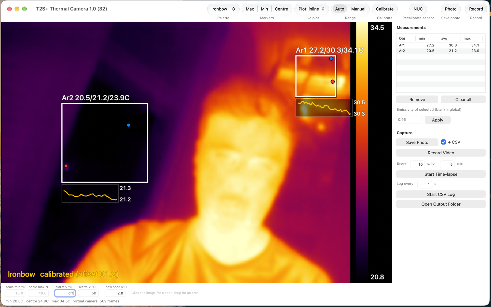
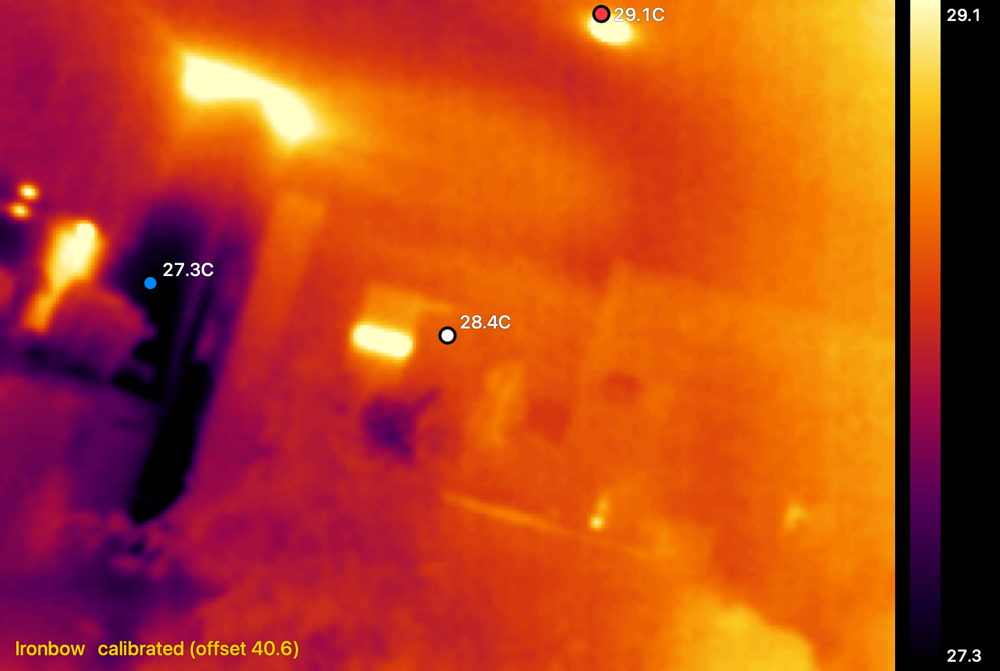

# T2S+ Thermal Camera for macOS

A native macOS app for the **Xinfrared / Xtherm T2S+** USB-C thermal camera:
live radiometric image, measurement tools, trend plots, recording -- and a
**virtual camera**, so the thermal view can be used directly in Teams, Zoom,
Meet or FaceTime.

Written because the vendor ships no macOS software for this camera, and because
the camera does not work with the obvious approaches on macOS at all (see
[Why this isn't a simple `cv2.VideoCapture` app](#why-this-isnt-a-simple-cv2videocapture-app)).



*Two measurement areas with live sparklines, the measurement table, and the
capture panel. What the virtual camera publishes is the image alone:*



## Supported hardware

| | |
|---|---|
| Camera | Xinfrared / Xtherm **T2S+** (also sold as InfiRay T2S+), hardware revision **V2** |
| USB identity | `0x1514:0x0001` — macOS reports `UVC Camera VendorID_5396 ProductID_1` |
| Sensor | 256×192 microbolometer, plus 4 rows of metadata = 256×196 frames |
| Stream | YUY2 (`yuvs`), fixed **25 fps**, one format only |
| macOS | 14.0 or later (the camera extension needs `.external` device support) |
| Mac | Apple Silicon and Intel; developed and tested on Apple Silicon |

Other cameras in this family (P2 Pro, T2L, 384×288 models) are **not**
supported as-is: the decoder's layout constants are specific to the 256-wide
sensor. The radiometry itself comes from
[IR-Py-Thermal](https://github.com/diminDDL/IR-Py-Thermal), which covers more
of the family, so porting is mostly a matter of the constants.

Any T2S+ unit should work, but **each camera needs its own one-point
calibration** — see
[Using a different unit](#using-a-different-unit-of-the-same-camera).

## What it does

- Live false-colour image, 6 palettes, marked hottest / coldest / centre points
- **Measurement tools**: spots and areas with min / average / max, per-object
  emissivity, drawn by clicking and dragging on the image
- **Live trend plots** above, below, or as sparklines next to each point
- **Manual level/span** and **isotherm alarms**
- **New hot / cold spot detection** against a drifting baseline
- **Capture**: PNG, radiometric CSV, H.264 video, time-lapse, and CSV logging
  of measurements over time
- **Virtual camera** at 1716×1152, usable in any video-conferencing app
- One-point temperature calibration and hardware NUC (shutter) recalibration

## How it works

The camera is a UVC device, but it does not behave like a webcam.

**1. It streams raw sensor counts, not a picture.** Put into raw mode, each
frame is 256×196 of 14-bit ADC values smuggled through a YUY2 container: 192
rows of image plus 4 rows of metadata. The metadata carries the unit's factory
calibration constants (`cal00`..`cal05`), the focal-plane-array and shutter
readings, and the current emissivity / distance / humidity settings.

**2. Temperature comes from a physics model, not a lookup.** Those constants
feed a radiometric model — Planck-style radiance inversion with atmospheric
transmittance — which is evaluated once per frame into a 16384-entry table
mapping raw count to °C. Every pixel is then a table lookup. The model is
ported from [IR-Py-Thermal](https://github.com/diminDDL/IR-Py-Thermal), which
reverse-engineered it for this camera family.

Two things had to be solved on top of it:

- The parameters must be **committed to the camera** with a save command, or
  they sit at a bogus factory default (emissivity 0.02) and the whole table
  comes out `NaN`.
- This hardware revision's **shutter-temperature register is unusable**, and
  upstream gave up on it. The app treats it as one unknown and solves for it
  by Newton's method against a single known temperature — that is what ⌘K
  does, and the result is persisted.

**3. Control goes over a UVC register back door.** The firmware reuses the
standard "Zoom, Absolute" control as a general register-poke channel. libusb
cannot claim the interface on macOS (the system UVC driver owns it), so
control writes go through IOKit directly.

**4. The virtual camera is a CoreMediaIO system extension.** The app renders
one frame and publishes it into a shared App Group container; the extension,
which macOS runs as a separate process, reads that and serves it as a capture
device. One render feeds the window, the virtual camera and the recorder, so
a call participant sees exactly what is in the window.

## Install

**From a release:** download the `.dmg`, drag **T2SCamera** to
`/Applications`, launch it, then use *T2S+ Thermal Camera ▸ Install / Manage
Camera Extension…* ▸ **Activate** and approve the extension in **System
Settings ▸ General ▸ Login Items & Extensions ▸ Camera Extensions**.

The app must live in `/Applications` — macOS refuses to activate a system
extension from anywhere else.

The virtual camera only produces live frames while the app is running.

## Build from source

Requires Xcode, [xcodegen](https://github.com/yonaskolb/XcodeGen)
(`brew install xcodegen`) and an Apple Developer account for signing — a system
extension cannot be loaded unsigned.

```bash
cd camera_extension
./build.sh            # build, sign, install to /Applications
./build.sh --run      # ... and launch
```

`build.sh` finds Xcode via `xcode-select -p` and the signing team from your
keychain, so there is nothing to edit. If either guess is wrong, copy
`build.config.example` to `build.config` and set `T2S_DEVELOPER_DIR` /
`T2S_TEAM_ID`; that file is git-ignored.

Nothing in the source hard-codes a team identifier: the entitlements use
Xcode's `$(TeamIdentifierPrefix)`, and the App Group name is read back at
runtime from the build's own code signature (`Shared/AppIdentity.swift`).

### Releasing a signed, notarised build

```bash
xcrun notarytool store-credentials T2SCamera \
  --apple-id you@example.com --team-id XXXXXXXXXX --password <app-specific-password>
# then set T2S_NOTARY_PROFILE="T2SCamera" in build.config
./build.sh --release
```

This archives, exports a Developer ID build, notarises it, staples the ticket
and produces a `.dmg` in `camera_extension/dist/`. Without notarisation
Gatekeeper blocks the app on other people's machines.

**The first Developer ID export needs a provisioning profile.** A system
extension carries a restricted entitlement (`system-extension.install`) that
only a provisioning profile can authorise, and creating one requires developer
account access. Plain `xcodebuild` cannot do it on its own and fails with
*"No profiles for 'cat.sysop.t2scamera' were found"*. Two ways round it:

- **App Store Connect API key** (scriptable): create one under *Users and
  Access ▸ Integrations ▸ Keys* and set `T2S_ASC_KEY_PATH`, `T2S_ASC_KEY_ID`
  and `T2S_ASC_ISSUER_ID` in `build.config`.
- **Once through Xcode** (no key needed): the script leaves the archive in
  `dist/T2SCamera.xcarchive` when export fails, so open *Window ▸ Organizer*,
  select it and *Distribute App ▸ Direct Distribution*. That creates and
  caches the profile; afterwards `./build.sh --release` runs unattended.

Note that manual signing does not help here, and forcing a Developer ID
identity onto an automatically signed build collides with its development
profile — the archive-and-export route above is the one that works.

This app **cannot go to the Mac App Store**: apps distributed there may not
install system extensions, and the GPLv3 licence below is incompatible with the
App Store terms in any case. Developer ID is the supported route.

### Window layout

The window is a video area with a control bar under it and a fixed 300pt panel
on the right. All of it is laid out in `viewDidLayout` from the current view
size rather than from fixed frames, so resizing cannot leave a control sitting
on top of the video. The thermal image is aspect-fit inside its area, letterboxed
rather than stretched -- which also keeps click-to-place accurate, since the
mouse mapping uses the same rect the image is drawn into.

The **toolbar** carries what gets changed constantly -- palette, markers, plot
placement, range mode, calibrate, NUC, save photo and record. It sits in the
title bar, so unlike another row of buttons it costs the video area nothing,
and it is customisable: right-click to add, remove or rearrange (new-spot
detection and the virtual-camera toggle are available there too).

The control bar under the image holds the numeric inputs: scale min/max, the
two alarm thresholds and the new-spot threshold.

The menu bar still holds everything, with the keyboard shortcuts and a
checkmark showing the current setting:

- **Capture** -- Save Photo (⌘S), Recording (⇧⌘R), Time-lapse, CSV Log, Open
  Output Folder (⇧⌘O)
- **Camera** -- Calibrate (⌘K), NUC (⌘R), Publish to Virtual Camera
- **View** -- Palette (⌘1..⌘6), Markers, Live Plot, Temperature Range,
  Highlight New Hot / Cold Spots

### Measurement tools

**Click the image to drop a spot; drag to draw whichever of area or line is
selected.** Pick that with **Drag creates** in the toolbar or under
**View ▸ Drag Creates** — and holding ⇧shift inverts it, so the other tool is
always one modifier away without changing the mode. The control bar under the
image spells out what the current setting does.

- A **spot** (`Sp1`, `Sp2`, ...) reports the average of its 3x3 neighbourhood,
  not one pixel. Single-pixel readout on this sensor jitters by around a degree.
- An **area** (`Ar1`, `Ar2`, ...) reports min / average / max, and marks where
  inside it the hottest and coldest pixels actually are -- an average alone
  hides a hot spot in the corner, which is usually what you are looking for.
- A **line** (`Li1`, `Li2`, ...) is a profile: it reports min / average / max
  along its length and marks the **N most prominent peaks** on it. Set how many
  and whether to look for hot or cold ones with *Line: mark N hottest/coldest*
  in the side panel.
- Selecting a row and setting **Emissivity** overrides it for that object only,
  for a scene with two materials in one frame (bare metal reads far too cold
  next to painted steel). Blank means "use the camera-wide value". The override
  is applied host-side; the camera keeps its own setting.

#### Why "peaks" and not "the N highest samples"

Taking the N highest readings along a line is useless: they all land on the
same hot spot, one pixel apart. The line tool looks for *local* extrema
instead, so N markers mean N distinct features.

Two details that matter in practice: a peak must be strictly better than at
least one neighbour, or a flat wall reports every one of its pixels as a peak;
and markers are spaced along the profile rather than by pixel index, because on
any line that is not horizontal consecutive samples differ by about a row
width, and a separation test on the index never fires.

If a profile has fewer distinct features than you asked for, you get fewer
markers rather than invented ones.

### Built-in markers

**max / min / centre** are toggled under **View > Markers**. Turning one off removes its
marker, its plot trace and its CSV column together -- what is on screen is what
is plotted and logged. The global max in particular is worth hiding once you
have placed your own objects, since it tends to latch onto a reflection.

### New hot / cold spots

**View > Highlight New Hot / Cold Spots** outlines areas that changed by more than the
given threshold, in a dashed red (hotter) or cyan (colder) box labelled with
the peak difference -- visually distinct from the solid boxes of placed
objects.

The baseline is captured the moment you tick the box, then drifts slowly (~45s
time constant). So "new" means *recently changed*: a spot that has been hot
since you started is not flagged, one that just appeared is, and one that stays
hot fades out of the highlight once the baseline catches up. Untick and tick
again to re-baseline on the scene as it is now.

Regions smaller than 12 connected pixels are ignored, so sensor noise does not
register as a spot.

### Live plot

**View > Live Plot** places a temperature-vs-time chart **above** or **below** the
image, or draws a small sparkline **next to each point** (that last one is
rendered into the frame itself, so it also reaches the virtual camera). The
chart holds two minutes and autoscales its temperature axis -- a trend of a few
tenths of a degree is what you are watching for, and a fixed axis flattens it
into a straight line.

Everything visible is plotted: enabled built-in markers plus every measurement
object (spots by value, areas by average).

### CSV logging over time

**Start CSV Log** appends a row every N seconds to
`T2S_log_<timestamp>.csv`: `timestamp`, `elapsed_s`, then one column per
visible marker and object (areas get `_min`, `_avg` and `_max`).

Columns are fixed when the log starts, so an object placed later is not logged
-- a CSV whose header stops matching its rows halfway down is worse than one
that misses a late addition. Stop and restart the log to pick up new objects.

This is separate from the per-photo CSV: that one is a single frame's 256x192
matrix, this one is a time series of the measurement objects.

### Level/span and alarms

**View > Temperature Range > Auto** re-stretches the colour ramp to each frame. That is why a
thermally flat scene looks like static, and why the picture flickers when
something hot enters the frame. **Manual** pins the ramp to a fixed
min/max in °C, which is the standard fix and makes small differences readable.

**alarm > / alarm <** paint everything above/below a threshold flat red/blue
(an isotherm). Leave blank for off.

### Saving

Everything goes to **~/Pictures/T2S+ Thermal**.

- **Save Photo** (⌘S) writes a PNG. With **+ CSV** ticked it also writes the
  full 256x192 temperature matrix, which is what makes the capture radiometric
  -- a PNG is only a picture, the CSV stays measurable afterwards.
- **Record Video** (⇧⌘R) writes H.264 .mov. Frames are stamped with real
  elapsed time, so a dropped frame becomes a pause rather than speeding the
  video up.
- **Time-lapse** saves a still every N seconds for M minutes, then stops
  itself. It reuses the CSV setting.

### Using a different unit of the same camera

Mostly yes, with one thing you must redo per camera.

**Portable, because it comes from the camera itself:** the factory calibration
constants `cal00..cal05`, the FPA and shutter readings, emissivity and the
atmospheric parameters are all read out of each frame's own metadata rows, so
another unit brings its own. The NUC reference and the dead-pixel map are
rebuilt per unit by **Recalibrate Sensor**.

**Not portable: `shutter_offset.json`.** It corrects this hardware revision's
unusable shutter-temperature register and is solved against a known
temperature, so its value belongs to the unit (and to the conditions) it was
solved on. Copying it to another camera gives confidently wrong readings.
Delete it and press ⌘K on the new camera instead.

**Device matching** no longer depends on the name. The app looks for USB
`VendorID_5396 ProductID_1` (0x1514:0x0001), falling back to any device
advertising a 256x196 format, and only then to the name "T2S+". That survives a
unit or firmware revision that names itself differently, and it cannot latch
onto our own virtual camera, which is 1716x1152.

**Model-level constants** in `ThermalDecoder` (`fpaOffset`, `fpaDivisor`,
`cal00Offset`) come from irpythermal's 256-wide profile, so they hold for this
sensor family but not for a different resolution.

Untested: only one physical unit was ever available here, so the above is
reasoning from where each value comes from, not from two cameras side by side.

### Version and build number

`MARKETING_VERSION` in `project.yml` is the version; the build number is a
counter in `camera_extension/build_number.txt` that `build.sh` bumps on every
build and passes to xcodebuild. Both show in the window title and in
**About T2S+ Thermal Camera**.

### Performance

Build **Release**, not Debug. Swift without optimisation is not slightly slower
here, it is catastrophic: the 5x5 blur alone went from 100ms to 1ms, and the
whole frame from 151ms (~6fps) to 8.7ms. `build.sh` already uses Release.

**The camera is the ceiling.** It advertises exactly one mode -- 256x196 at a
fixed 25fps -- so 25fps is all the real thermal data there is. Measured
end to end, the app is already there: frames arrive at 25.4/s and 25.4/s are
processed (nothing dropped), using ~12ms of the 40ms budget, and the virtual
camera outputs a steady 25fps.

Run with `T2S_PROFILE=1` to print that breakdown every 5 seconds. Use it rather
than timing from outside -- polling the published frame file's mtime from a
shell undercounts badly, and reported 20fps for a pipeline actually running at
a full 25.

Never launch it with `sudo`: root does not hold the camera TCC permission and
sees a different, scrambled AVFoundation device list.

### App icon

The icon is generated, not a checked-in binary, so it stays editable and reuses
the Ironbow stops from `Palettes.swift` -- the icon and the live image are the
same colour ramp. To change it, edit `make_icon.swift` and re-run:

```bash
cd camera_extension
swift make_icon.swift T2SCameraApp/Assets.xcassets/AppIcon.appiconset
./build.sh
```

Each size is drawn natively rather than downscaled from one large canvas; the
viewfinder brackets are thin enough that scaling 1024 -> 16 destroys them. The
scan lines and drop shadow are skipped below 128px and the crosshair below
32px, for the same reason.

If a stale icon persists in the Dock or Finder, it is the LaunchServices icon
cache, not the build -- `build.sh` already re-registers the app, but the Dock
can need a restart.

### Render resolution

The frame is rendered at **1716x1152** and shown in the window downscaled by
two. That is driven by the virtual camera, not the window: a video-call client
scales the feed up into its tile, and at the old 858x576 the readouts came out
unreadable. Overlay text and strokes are scaled by 2.6 rather than 2, so they
also take up more of the frame than they used to -- sharpness alone does not
help in a small tile.

**Changing the render size means re-activating the extension.** The extension
hard-codes the frame size in `Config.swift` (`fixedCamWidth`/`fixedCamHeight`)
and must match the app exactly; if it does not, it rejects every frame and
publishes flat grey. After changing it:

```bash
./build.sh
/Applications/T2SCamera.app/Contents/MacOS/T2SCamera --activate-extension
```

Check with `systemextensionsctl list` that the new build number is the one
marked `[activated enabled]`. The superseded copy sits at `[terminated waiting
to uninstall on reboot]`, which is normal.

Cost of the larger render, measured: 11.9ms -> 15.5ms per frame, still 25.2
frames arriving and 25.2 processed, so nothing is dropped.

### Virtual camera

The app writes each rendered frame into the App Group container
`<TeamID>.cat.sysop.t2scamera`, and a CoreMediaIO camera extension bundled
inside the app publishes that as **"T2S+ Thermal Camera"**.

Install it once via the app menu -> *Install / Manage Camera Extension...* ->
**Activate**, then approve it in System Settings -> General -> Login Items &
Extensions -> Camera Extensions. The virtual camera only produces live frames
while the app is running (it shows mid-grey otherwise).

Because the app itself is sandboxed, it needs `com.apple.security.device.camera`
and `com.apple.security.device.usb`. Without the camera entitlement
`AVCaptureSession` yields no frames *and no error*, which looks exactly like a
dead camera.

### Calibrating the native app

The shutter offset is solved against one known temperature and then persisted
to `shutter_offset.json` **in the App Group container**, so it survives
restarts.

Do not copy the Python prototype's `shutter_offset.json` over it. Both solve
for the same physical quantity, but the value that comes out depends on the
camera state at the moment you calibrate, so a number solved in one is not
meaningful in the other -- calibrate the Swift app once with ⌘K instead.

## Why this isn't a simple `cv2.VideoCapture` app

Two things about this specific camera don't work the normal way on macOS:

1. **`cv2.VideoCapture` cannot open this camera at all** -- it raises
   `VIDEOIO(AVFOUNDATION): raised unknown C++ exception!` on open, every time,
   with every OpenCV version tried. This matches a confirmed, unresolved
   upstream bug (`opencv/opencv#22912`) where someone else hit the identical
   crash with their own USB thermal camera. `ffmpeg`'s AVFoundation input
   opens it fine, so this app captures frames via an `ffmpeg` subprocess
   instead.

2. **The camera's calibration/mode commands go over the UVC "Zoom, Absolute"
   control** (confirmed by decoding its USB descriptor: Camera Terminal ID 1
   declares that control, selector `0x0B`). On Linux, `cv2.CAP_PROP_ZOOM`
   reaches it directly. On this Mac, `pyusb`/`libusb` can *read* the
   descriptor but cannot *claim the interface* to send it (`errno 13:
   insufficient permissions` -- a known libusb-on-macOS/UVC limitation, root
   included). The vendored `uvc-util` (`vendor/uvc-util/`, pure IOKit, MIT)
   sends the same control successfully instead.

`t2s_capture.py` is a small shim presenting just enough of a
`cv2.VideoCapture`-like interface (`.read()`, `.set()`, `.get()`,
`.release()`) backed by those two, so `irpythermal.py` (the capture/decode
library, see Credits) runs completely unmodified on top of it.

This was verified against the live camera: after switching to raw sensor
mode through this path, the captured pixel values land exactly in the range
the camera's own embedded metadata reports as min/max -- i.e. the frame
layout, the control command, and the decode math all check out against real
hardware, not just in theory.

## Setup

```
python3 -m venv venv && source venv/bin/activate
pip install -r requirements.txt
```

`ffmpeg` must be installed (`brew install ffmpeg`) -- everything else needed
(`vendor/uvc-util/build/uvc-util`) is already built and included. If it
doesn't run on your Mac (wrong CPU architecture), rebuild it with:
```
vendor/uvc-util/build.sh
```
(needs Xcode Command Line Tools' `clang`, not full Xcode).

## Run

```
source venv/bin/activate
python3 thermal_view.py
```

The camera is found by name ("T2S+"), not a fixed index -- macOS's
AVFoundation device ordering isn't stable across runs, so don't hardcode one.
If auto-detection ever picks the wrong device, force it with
`--device <n>` using whatever index `ffmpeg -f avfoundation -list_devices
true -i ""` currently shows for it.

**Do not run with `sudo`** -- root does not hold the same camera (TCC)
permission as your normal user, and it changes AVFoundation's device
enumeration entirely.

Startup takes up to ~20 seconds: the camera stabilizes and runs an initial
shutter/NUC calibration, and its physical shutter stays closed for another
1-2 seconds afterward (the app waits this out automatically before showing
the first frame). This is normal -- the library prints progress throughout.

macOS will prompt for camera permission the first time -- allow it.

### Keyboard controls

| Key | Action |
|---|---|
| `p` / `o` | Next / previous color gradient |
| `1`-`6` | Jump directly to a gradient (Ironbow, White Hot, Black Hot, Rainbow, Hot, Inferno) |
| `k` | Calibrate: type the known real temperature at the center crosshair (typed directly in the app window). Takes a few frames while it solves for the right correction -- see Calibration below |
| `c` | Hardware recalibration: closes the shutter and re-runs flat-field (NUC) correction |
| `e` | Attempt to change emissivity (0.01-1.0) on the sensor -- best-effort, see Calibration |
| `r` | Reset to the default starting guess |
| `h` | Toggle this shortcut list on screen |
| `q` / `Esc` | Quit |

The max temperature (red marker), min temperature (blue marker, both robust
to single dead/noisy pixels -- see Calibration) and center spot (white
marker) are always shown, plus a color scale bar on the right edge labeled
with the current frame's min/max.

## Calibration

**This app uses irpythermal.py's own physics-based temperature formula**
(`get_temp_table()`), which computes absolute temperature from this specific
unit's real factory calibration constants (`cal_00`..`cal_05`, read from the
camera's own metadata every frame) -- not an approximation. That wasn't
always true here: an earlier version of this app abandoned that formula
because it produced NaN across ~3800 of its 16384 entries and wasn't even
monotonic. Both problems traced to the same root cause, confirmed against
the real camera:

- `irpythermal.py`'s parameter setters (`set_emissivity` etc.) never call
  the separate `save_parameters()` command (UVC `0x80FF`) needed to actually
  commit a change, so emissivity was silently stuck at a bogus factory
  default (`0.02` -- near-mirror reflectivity, physically implausible).
  Calling `save_parameters()` right after fixes it (this app does so at
  startup) -- and with a sane emissivity, the NaN count dropped to zero.
- The remaining broken input is `camera.offset_temp_shutter`, a correction
  hook the library already defines for its own known-bad shutter-temperature
  reading on this V2 hardware (the library author: *"I was unable to
  determine the logic... left that as hard coded room temperature"*). Once
  emissivity was fixed, sweeping this value produced a clean, monotonic,
  smoothly-varying, plausible temperature curve with a stable, tight
  min/max spread -- the real calibration working correctly for the first
  time in this whole investigation, not a guessed slope.

- **On startup**, `offset_temp_shutter` defaults to `76.0`
  (`DEFAULT_SHUTTER_OFFSET` in `thermal_view.py`), measured to give a
  plausible ~20C in one test session. This gets you a believable image
  immediately, at the cost of accuracy until you calibrate.
- **`k`**: point the center crosshair at something of known temperature,
  type the real value in (right there in the app window). The app solves
  for the `offset_temp_shutter` value that makes the center read that
  temperature (Newton's method over a few frames, since the relationship
  isn't exactly 1:1 -- confirmed empirically), typically converging in well
  under a second.
- **The solved value is saved** to `shutter_offset.json` and auto-loaded on
  every future launch as the new starting guess. Unlike a sensor-electronics
  property, though, there's no strong guarantee this value is stable across
  sessions (it corrects a register the library's own author couldn't fully
  characterize) -- treat it as a good starting point that may still need a
  quick `k` touch-up, not a guaranteed-permanent fix.
- **`c` — hardware shutter/NUC recalibration**: the real per-pixel flat-field
  correction, done by briefly closing the camera's physical shutter. Run this
  if the image looks noisy/patterned, or after the camera's been running a
  while and drifted. Uses `calibrate_hardware()` rather than
  `irpythermal.py`'s own `camera.calibrate()` -- that function assumes the
  shutter is fully closed after a fixed ~1.5-2s delay before capturing a
  single frame as its reference, but shutter timing here is highly variable
  (confirmed empirically: 0.15s-7.6s just to *reopen*), and when that
  assumption is wrong the reference captures a still-transitioning or
  partially-open view. Confirmed live: this produced 823 "dead pixels"
  forming one contiguous block -- real scene content misread as sensor
  defects, then permanently smeared into every later frame by the library's
  own inpainting correction. `calibrate_hardware()` instead waits for the
  raw signal to actually go uniform (low, sustained std) before trusting
  it, and -- as a hard safety net regardless of whether that wait was
  enough -- refuses to apply dead-pixel correction at all if the flagged
  count is implausibly high (real defects here have never exceeded ~20
  pixels; a run flagging more skips the correction and tells you, rather
  than risk corrupting the image). The app waits for the shutter to
  physically reopen before showing frames again, which can itself take a
  few seconds for the same reason (times out after 20s with a warning
  instead of silently giving up early).

## Known limitation: sensor noise on low-contrast scenes

This sensor's own per-pixel readout noise is high enough that, pointed at a
thermally uniform scene, the auto-contrast display stretch can turn it into
near-structureless static -- confirmed directly: a real scene became
indistinguishable salt-and-pepper noise when the frame's real dynamic range
was very small. A 20-frame-averaged NUC reference (vs `irpythermal.py`'s
default single-frame reference) only reduced it ~30%, so it's not primarily
a calibration artifact; a light 5x5 Gaussian blur before display (`smooth_
frame()` in `thermal_view.py`) recovers real structure much more
effectively (~50% noise reduction, confirmed) and is what every commercial
thermal camera does for exactly this reason. Numeric readouts are computed
from this same smoothed frame, so they stay consistent with what's on
screen. Residual noise will still be more visible on a scene with very
little real temperature variation -- that's the sensor's actual noise floor
showing through, not a bug.
- **`e` — emissivity**: sends a real, working command (confirmed above) --
  but only the *first* emissivity change in a session reliably takes effect.
  Changing it again was confirmed to apply on an unpredictable delay (one
  test read back a value set by an *already-exited* earlier script), so
  there's no reliable way to confirm success or failure for an in-session
  change, and the app says so rather than guessing. For a value you can
  count on, set it once at launch: `python3 thermal_view.py --emissivity
  0.95`.

## Files

### Native app (`camera_extension/`)

- `T2SCameraApp/` -- the Swift app: `ThermalCapture` (AVFoundation),
  `ThermalDecoder` (metadata + temperature table), `UVCControl` (IOKit register
  writes), `Palettes`, `ThermalProcessor`, `ThermalRenderer`, `Calibration`,
  `VirtualCameraFeed`, `ThermalViewController`, `ExtensionInstaller`
- `T2SCameraExtension/` -- the CoreMediaIO camera extension that publishes the
  virtual camera
- `project.yml` / `build.sh` -- xcodegen project and one-shot build + install
- `make_icon.swift` -- generates the app icon set

### Python prototype

- `thermal_view.py` -- the app: capture loop, calibration solver, palettes,
  overlay, calibration UI
- `irpythermal.py` -- vendored library: frame capture, hardware calibration/
  control, AND its physics-based temperature formula (see Calibration above
  for what it took to make that formula trustworthy on this camera);
  unmodified except a 3-line NumPy 2.x compatibility fix (see its own
  comments -- upstream was written against NumPy 1.x; `python_int |
  numpy.uint8` now raises `OverflowError` instead of upcasting)
- `t2s_capture.py` -- the ffmpeg + uvc-util shim described above
- `vendor/uvc-util/` -- vendored native control-sending tool
- `shutter_offset.json` -- your calibrated `offset_temp_shutter` value,
  created after your first `k` calibration; delete it to go back to the
  built-in guess

## Licence

**GPLv3.** `ThermalDecoder.swift` is a port of `irpythermal.py` from
[IR-Py-Thermal](https://github.com/diminDDL/IR-Py-Thermal) by diminDDL, which
is GPLv3, so this project is a derivative work and is licensed the same way.
The full text is in [LICENSE](LICENSE).

In practice: you may use, modify, sell and redistribute this, but anything you
distribute must also be GPLv3 and must come with its source.

### Credits

- **[IR-Py-Thermal](https://github.com/diminDDL/IR-Py-Thermal)** (GPLv3) by
  diminDDL — reverse-engineered this camera family's radiometric model. The
  temperature maths here is a port of it; without that work this project would
  not exist.
- **[uvc-util](https://github.com/jtfrey/uvc-util)** (MIT) by Jeff Frey —
  vendored in `vendor/`, used by the Python prototype to send UVC control
  requests. Its licence is in `vendor/uvc-util/LICENSE`.
- Camera-extension activation flow follows
  [ldenoue/cameraextension](https://github.com/ldenoue/cameraextension).
